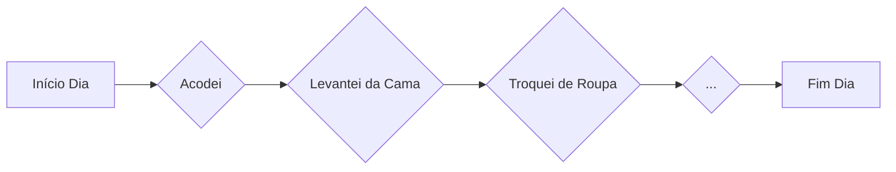
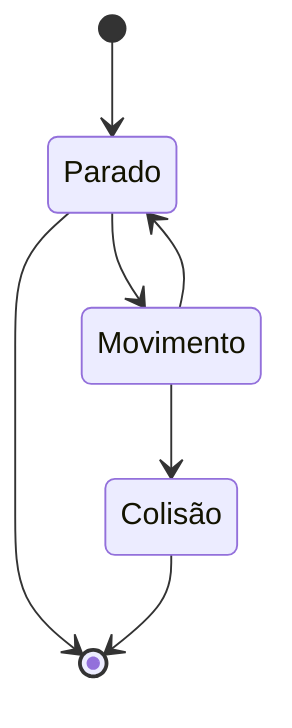
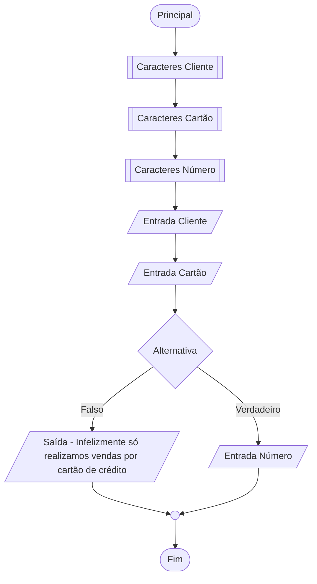
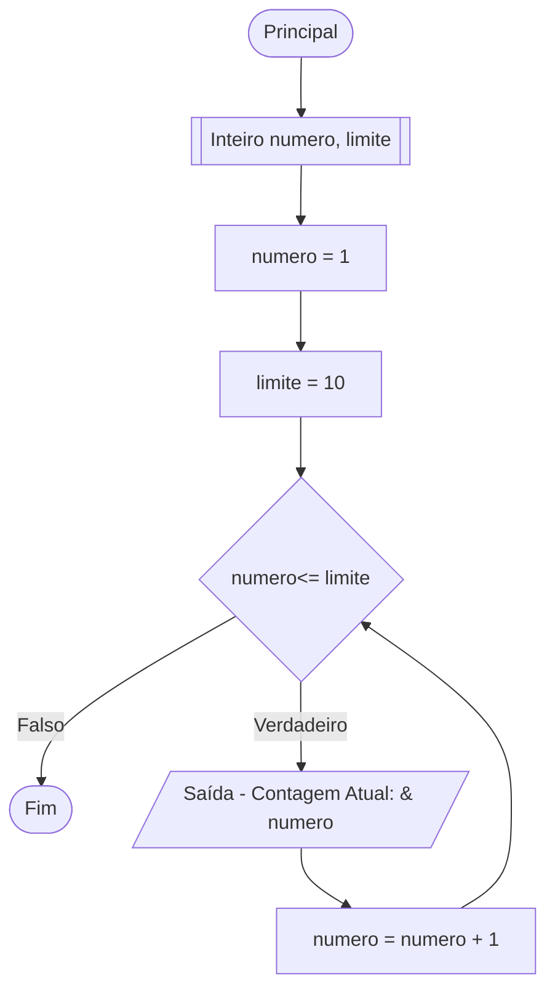

# 💻 Introdução à Lógica e à Programação

### 💡 O que é lógica?
- "coerência de raciocínio, de ideias"
- "sequência coerente, regular e necessária de acontecimentos, coisas"

### 🧩 Lógica de Programação

> "Lógica de programação significa apenas contextualizar a lógica na programação de computadores, buscando a melhor sequência de ações para solucionar um problema" 

### Metacognição

> "Pensar como você pensa"

###  Abstração

> "Abstração é a habilidade de concentrar nos aspectos essenciais de um contexto qualquer, ignorando características menos importantes ou acidentais"

## :memo:   Algoritmos e pseudocódigos

### Algoritmo

> "é uma sequência de passos que resolve um problema"

#### :pencil2: Exemplo

### :u7121: Pseudocódigo

> "Pseudocódigo é uma forma genérica de escrever um algoritmo, utilizando uma linguagem simples (nativa, ou seja, em português a quem o escreve de forma a ser entendida por qualquer pessoa)"

## :arrows_counterclockwise: Fluxograma e variáveis

### 💡 O que é um Fluxograma?

> - "Fluxograma é uma ferramenta utilizada para representar graficamente o algoritmo, isto é, a sequência lógica e coerente do fluxo de dados"
> - "Fluxograma é um tipo de diagrama e pode ser entendido como uma representação esquemática de um processo. Podemos entendê-lo, na prática, como a documentação dos passos necessários para a execução de um processo qualquer "
#### :pencil2: Exemplo

##### **:eyes: Não existe um padrão que define o que cada bloco de um fluxograma representa. O importante é que o fluxograma seja claro!**

### 💡 O que são Variáveis?

> - "Na programação, uma variável é um objeto (uma posição, frequentemente localizada na memória) capaz de reter e representar um valor ou expressão. "
> - "Uma variável é um espaço na memória do computador destinado a um dado que é alterado durante a execução do algoritmo." 

##### **:eyes: Dentro de um Pseudocódigo, uma variável, GERALMENTE, é declarada no início das instruções.**
#### :pencil2: Exemplo

    INÍCIO
    DECLARA nota1: número
    DECLARA nota2: número
    DECLARA nota3: número
    DECLARA nota4: número
    DECLARA media: número
    LEIA (nota1)
    LEIA (nota2)
    LEIA (nota3)
    LEIA (nota4)
    media=(nota1+nota2+nota3+nota4)/4
    IMPRIMIR (media)
    FIM
#### :round_pushpin: Tipos de Variáveis

> As variáveis e as constantes podem ser classificadas **basicamente** de quatro tipos:
> 1. Numéricas
> 2. Caracteres
> 3. Alfanuméricas
> 4. Lógicas

### 💡 O que é uma Constante?

> As constantes são valores imutáveis e não são alterados durante a vida útil do programa.

#### :pencil2: Exemplo

    INÍCIO
        DECLARA pi: 3,14
        DECLARA raio: número
    FIM
##### ** :eyes: O valor da CONSTANTE 'pi' não será alterado. Será 3,14 durante toda a execução do programa.**

## :heavy_plus_sign: :heavy_minus_sign:  Expressões aritméticas :heavy_multiplication_x: :heavy_division_sign:

> "São expressões que utilizam operadores aritméticos e funções aritméticas envolvendo constantes e variáveis"
#### :pencil2: Exemplo

    EXIBIR
    50 + 50
    TOTAL = 50
#### :round_pushpin: Operadores aritméticos
	
|Soma| + | Exemplo: 50 + 50 = 100 |
|--|--|--|
|**Subtração**| **-** | **Exemplo: 50 - 50 = 0** |
|**Multiplicação**| **\*** |  **Exemplo: 50 * 50 = 2.500** |
|**Divisão**| **/** | **Exemplo: 50 / 50 = 1**
|**Potenciação**| **^** | **Exemplo: 2 ^ 2 = 4**
|**Porcentagem**| **%** | **Exemplo: 100 + 10% = 110**

##### ** :eyes: Em linguagens de programação (Java, Python, etc.) os símbolos dos operador podem ser diferentes ou realizar um cálculo específico. Ex.: A porcentagem (%), na maioria das linguagens de programação, retorna o resto de uma divisão 8 % 3 = 2  .**

### Expressões literais

>"São expressões com constantes e/ou variáveis que tem como resultado valores literais. Iremos utilizar as expressões literais na atribuição de valor para uma variável ou constante"

#### :pencil2: Exemplo

    nome = "José da Silva"
    nome <- "José da Silva"
    media = (nota1+nota2+nota3+nota4)/4 

### Operadores relacionais

> "São expressões compostas por outras expressões por outras expressões ou variáveis numéricas com operadores relacionais. As expressões relacionais retornam valores lógicos (verdadeiro / falso)"  

#### :pencil2: Exemplo

| Símbolo |Nome do Operador | Exemplo | Significado |
|--|--|--|--|
|**>**|Maior que| x>y| x é maior que y?|
|**>=**|Maior ou Igual| x>=y| x é maior ou igual a y?|
|**<**|Menor que| x<y| x é menor que y?|
|**<=**|Menor ou Igual| x<=y| x é menor ou igual a y?|
|**==**|Igualdade| x==y| x é igual a y?|
|**!=**|Diferente de| x!=y| x é diferente de y?| 

### Tomadas de Decisão

> "Quando escrevemos programas, geralmente ocorre a necessidade de decidir o que fazer dependendo de alguma condição encontrada durante a execução"

#### :pencil2: Exemplo

### Concatenação

> - Concatenação é um termo usado em computação para designar a operação de uni o conteúdo de duas strings*.
> *string é uma sequência de caracteres
> - Agrupamento de duas ou mais células que, incluindo fórmulas, textos ou outras informações contida no seu interior, dá origem a um **único resultado**. 

### Estrutura de repetição

> Dentro da lógica de programação é uma estrutura que permite executar mais de uma vez o mesmo comando ou conjunto de comandos, de acordo com uma condição ou com um **contador**.

#### :pencil2: Exemplo

## Linguagem de Programação e o Portugol

### 💡 O que é Linguagem de Programação?

> - "Linguagem de Programação é uma linguagem escrita e formal que especifica um conjunto de instruções e regras usadas para gerar programas (software). Um software pode ser desenvolvido para rodar em um computador, dispositivo móvel ou em qualquer equipamento que permita sua execução"
> - "O que é óbvio para você, certamente não é óbvio para uma máquina. E se você quer que a máquina faça algo para você, é preciso **falar com ela**".
> :red_circle: **A função das linguagens de programação é servir de um meio de comunicação entre humanos e computadores**

#### :round_pushpin: Tipos de Linguagem de Programação

 **1. Alto Nível** 
 > Essas são aquelas cuja sintaxe se aproxima mais da nossa linguagem e se distanciam mais da linguagem de máquina.
 
 **2. Baixo Nível**
 > É aquela que se aproxima mais da linguagem de máquina. Essas são as que você precisa ter o conhecimento direto da arquitetura do computados para fazer alguma coisa.

**3. Compiladas**
> É uma linguagem de programação em que o código fonte é executado diretamente pelo sistema operacional ou pelo processador, após ser traduzido por meio de um processo chamado compilação.

**4. Interpretadas**
> É uma linguagem de programação em que o código fonte é executado por um programa de computador chamado interpretador, que em seguida é executado pelo sistema operacional ou processador. 

