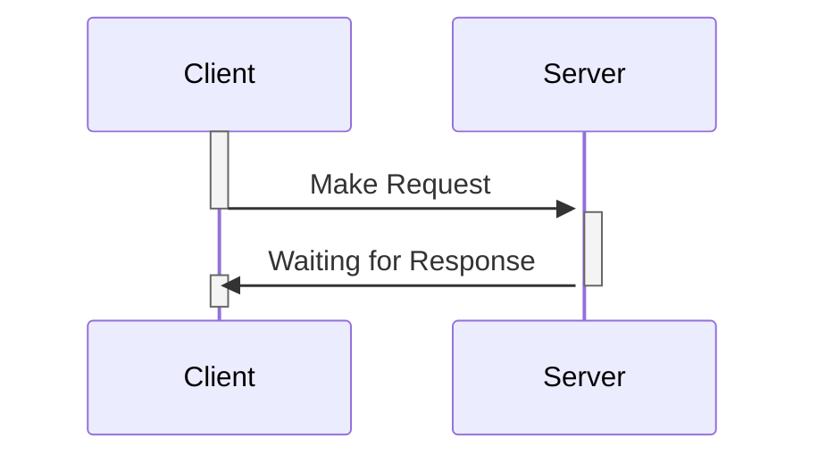
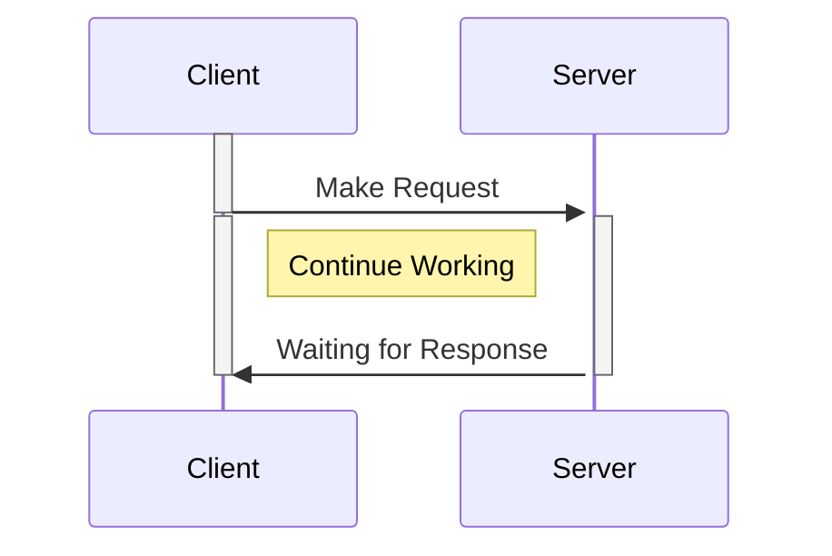
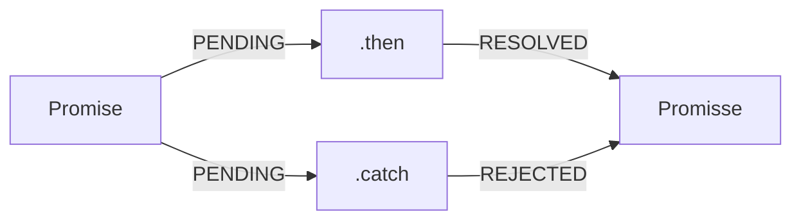


# Javascript - Assíncrono

## Assíncrono
> "Que não ocorre ou não se efetiva ao mesmo tempo."
 
 #### :pencil2: Exemplo

> - Síncrono - Um aluno que estuda em uma faculdade presencial. Ele terá que assistir as aulas de acordo com a grade curricular. E está presente no momento que as aulas estão sendo ministradas.
>  - Assíncrono - Os Cursos da **DIO**. O aluno poderá assistir as aulas quando quiser e na ordem que quiser. 

   ## Definição

> O Javascript roda de maneira **síncrona**

 #### :pencil2: Exemplo Síncrono
 

 #### :pencil2: Exemplo Assíncrono
 

## Promises

> - Objeto de processamento assíncrono
> - Inicialmente, seu valor é desconhecido. Ela pode, então, ser **resolvida** ou **rejeitada**.

### Estados da Promise

> Uma promise pode ter 3 estados
> 1. Peding - Pendente
>  2. Fulfilled - Completado
>  3. Rejected - Rejeitado

## Estrutura

    const myPromise = new Promise((resolve, reject) => {
    	 window.setTimeout(() => {
    		 resolve(console.log('Resolvida'));
    	}, 2000);
    }); 

### Manipulação

    const myPromise = new Promise((resolve, reject) => {
        	 window.setTimeout(() => {
        		 resolve(console.log('Resolvida'));
        	}, 2000);
        });
    
    await myPromise
    			.then((result) => result + ' passando pelo then')
    			.then((result) => result + ' e agora acabou!')
    			.catch((err) => console.log(err message));
    			
    // Após 2 segundos, retornará o valor
    // "Resolvida passando pelo then e agora acabou!"

 ## Async / await

> Funcões assíncronas precisam dessas duas palavras chave.

 #### :pencil2: Exemplo Assíncrono

    async function resolvePromise() 
    {
        const myPromise = new Promise((resolve, reject) => {
                	 window.setTimeout(() => {
                		 resolve(console.log('Resolvida'));
                	}, 2000);
                });
            
            await myPromise
            			.then((result) => result + ' passando pelo then')
            			.then((result) => result + ' e agora acabou!')
            			.catch((err) => console.log(err message));
    
	    return resolved;
    }

 ## API

> Application Programming Interface
>  - Uma API é uma forma de intermediar os resultados do back-end com o que é apresentado no front-end.
>  - Você consegue acessá-las por meio de URLs.

### JSON

#### JSON: JavaScript Object Notation

> É muito comum que APIs retornem seus dados no formato .json, portanto precisamos tratar esses dados quando os recebermos.

 #### :pencil2: Exemplo

    {
    	"discription": "schema POST bank",
    	"type": "object",
    	"properties": {
    	"id": {
    		"type": "number",
    		"minimum": 0 	
    		}
       }
    }

## fetch

> É o comando responsável por consumir APIs

### Estrutura

    fecth(url, options)
    .then(response => response.json())
    .then(json => console.log(json))
    //Retorna uma Promise

  #### :pencil2: Exemplo

> GET

    fecth('https://endereco-api.com/', {
    method: 'GET',
    cache: 'no-cache'
    })
        .then(response => response.json())
        .then(json => console.log(json))

> POST

    fecth('https://endereco-api.com/', {
    method: 'POST',
    cache: 'no-cache'
    body: JSON.stringify(data)
    })
        .then(response => response.json())
        .then(json => console.log(json))

