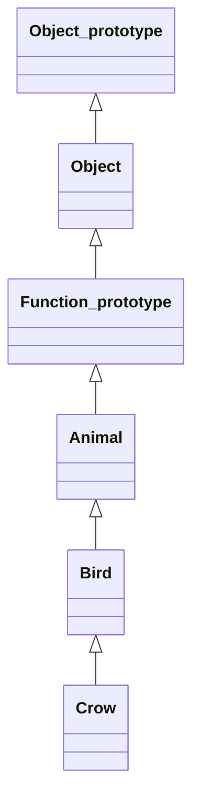
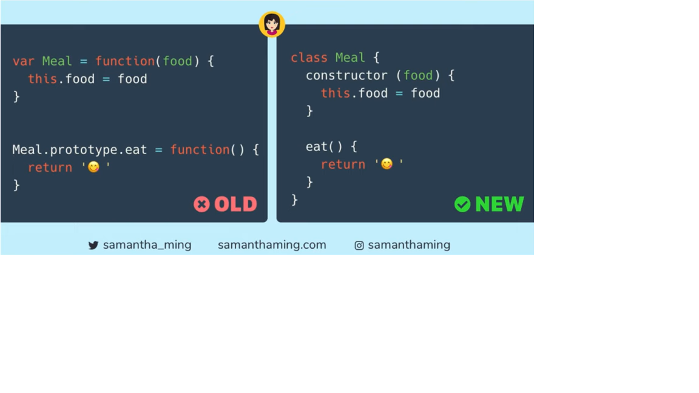
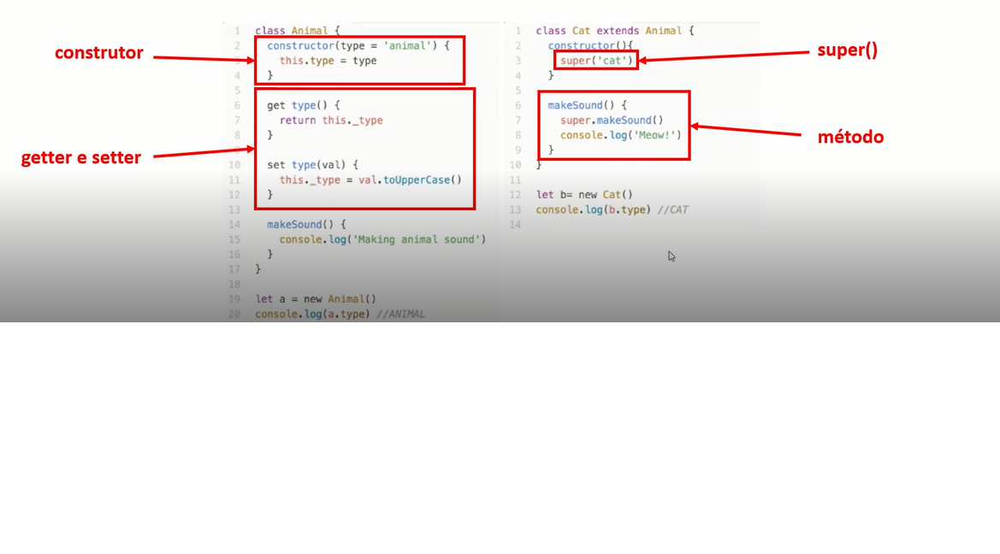

# Javascript - Orientações a objetos

## Paradigmas

> Os programas são "objetos" que possuem uma série de propriedades.
> 
> **Pilares**
> - Herança
> - Polimorfismo
> - Encapsulamento
> - Abstração

### Pilares

#### Abstração

> "Processo mental que consiste em isolar um aspecto determinado de um estado de coisas relativamente complexo, a fim de simplificar a sua avaliação classificação ou para permitir a comunicação do mesmo"

#### Herança

> O objeto filho herda propriedades e métodos do objeto pai.

#### Encapsulamento

> Cada classe tem propriedades e métodos independentes do restante do código.

#### Polimofismo

> Objetos podem herdar a mesma classe pai, mas se comportarem de forma diferente quando invocamos seus métodos.

## Protótipos

> Todos os objetos Javascript herdam propriedades e métodos de um prototype. O objeto Object.prototype está no topo desta cadeia.

#### :pencil2: Exemplo

### Cadeia de Protótipos

> prototype chain

#### :pencil2: Exemplo

## Classes

> Syntax sugar: uma sintaxe feita para facilitar a escrita
> Javascript não possui classes nativamente. Todas as classes são objetos e a herança se dá por protótipos 

